# 专题 4  离域与共轭

!!! note

    交替的单双键形成了**共轭（conjugate）**结构，导致了电子的**离域（delocalization）**效应，使得分子兼具**稳定性（stability）**与**反应性（reactivity）**

## TOPIC 1 离域与共轭的概念 

### 苯环结构的发现
苯的分子式在被发现之后，很快就确定是C6H6了。但其结构式仍然众说纷纭。直到1865年凯库勒提出了他的单双键交替结构。

这个结构看似合理，但仍有一些疑点。首先，我们确定了6个C都是 $\mathrm{sp}^2$ 杂化，每个C原子留出了1个p轨道，然后6个p轨道两两组合形成3个 $\pi$ 键。

但问题是怎么两两组合？好像有两种组法，对于苯自身来说两种方式是一样的，但对于一些有取代基的苯环，比如邻位取代，就会出现两种结构：

<figure markdown>
  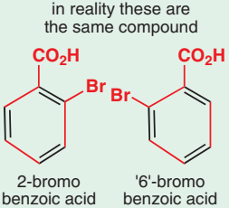{ width = "10" }
</figure>

但实验证实不存在两种结构。因此凯库勒结构存在问题，他本人也提出了解决方案：苯环会在两种结构之间快速地转换。这种说法接近了真相，但没有完全接近 —— 因为根本没有化学反应发生！

实际上，合理的解释是，这6个p轨道组合在一起，形成了6个分子轨道，电子重新排布，电子密度在苯环上下两面呈现出环状，形成了对称的电子云密度。我们称电子的这种现象为**离域**，也就是电子不局限在所谓的 $\pi$ 键中运动，而是在六个原子周围都会出现

### 用共振式表示离域现象
    
有人就用一个圈代替苯环中的三个双键，形象地表示出了电子的离域现象。

这种画法虽然直观，但不方便表示机理 —— 因为一根键代表2个电子，我们依然用3根双键表示苯环，此时就不用在意双键怎么排布了，反正都是一样的
    
那怎么体现离域呢？虽然凯库勒提出的解释是错误的，但我们可以借鉴并加以修改，用弯曲箭头来表示电子并不是局限在一根双键里的：

<figure markdown>
  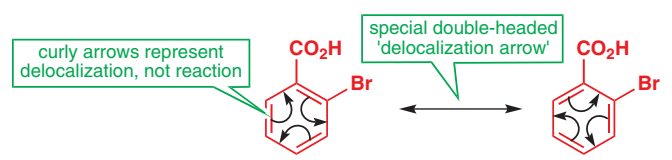{ width = "10" }
  <figcaption>共振式的写法</figcaption>
</figure>

注意中间的双向箭头，它不同于反应中的可逆符号，因此表示的不是化学转化过程，称为**共振箭头**

两边的结构可以视为是在传统规则的限制下，六个电子可以有两种排布方式，称为**极限式**

书上将这种结构称为**共振式**，并将苯的真实结构视为是两种极限式的叠加态

!!! warning "注意"

    1 千万不能认为真实结构是共振式中的其中一种极限式结构，或者认为真实结构在极限式之间转换

    2 也不能因为弯曲箭头就认为电子真的在流动

实验证实苯环中CC键长为139.5pm，介于单键（154.1pm）与双键（133.7pm）之间

### 非环状也可以离域

我们研究下面这个结构：

<figure markdown>
  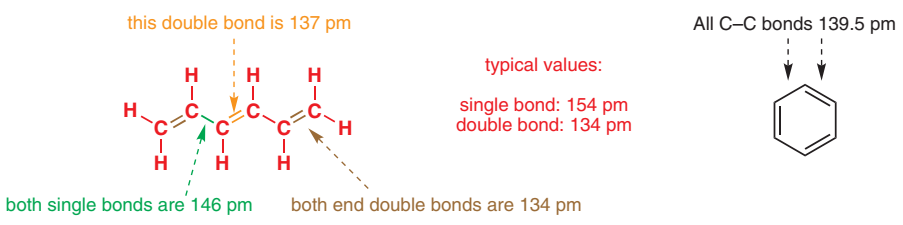{ width = "10" }
</figure>

实验证实，中间双键的键长大于两侧双键的键长（为典型值），两个单键的键长也小于典型值

同样，这种现象也是因为6个p轨道重新组合形成了分子轨道，产生了离域现象

### 共轭

* 当两个双键由一个单键连接起来时，这两个双键就形成了共轭结构，性质与一般的双键有所差别

* 此时所有p轨道都可以形成有效重叠，如果双键中间是0个、2个或更多单键，就不能共轭

### 共轭下的分子轨道

以丁二烯为例，我们将两个 $\pi$ 键的4个轨道重新组合，根据分子轨道理论，应当组成4个新轨道：

<figure markdown>
  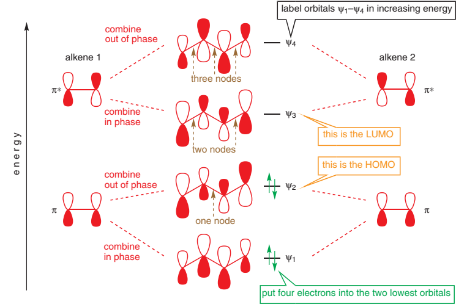{ width = "10" }
</figure>

这4个新轨道的能级存在大小顺序，我们从低到高依次用 $\psi_1$ 至 $\psi_4$ 表示

!!! note "如何比较能级大小"

    专题2中说过节面（node）的存在会导致轨道能级的提高，因此，node越多，能级越高

    例如 $\psi_4$ 有3个node，因此能级最高，$\psi_1$ 没有node，因此能级最低

此外，注意到新的分子轨道中，各个p轨道的大小不一样，可以当做是各个p轨道在该分子轨道中的系数不同（这是由量子力学计算得出的）
。你只需要知道 $\psi_1$ 和 $\psi_4$ 中间轨道系数大， $\psi_2$ 和 $\psi_3$ 两侧轨道系数大即可。

然后电子按顺序填充入轨道，一共4个电子，分别填入 $\psi_1$ 和 $\psi_2$

接下来，我们看这两个轨道。$\psi_2$ 中第1、2个p轨道之间没有node，因此有成键作用，第3、4个p轨道之间同样如此。而第2、3个p轨道之间存在node，因此有取消成键的作用。而 $\psi_1$ 中均为成键作用

<figure markdown>
  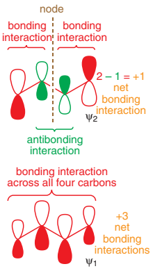{ width = "10" }
</figure>

因此，总体来看电子会在C1和C2、C3和C4之间，因为 $\psi_2$ 中C2-C3的反键作用抵消了 $\psi_1$ 中的成键作用，但是要注意，因为  $\psi_2$ 里中间2个p轨道的系数小，$\psi_1$ 里中间2个p轨道的系数大，因此这个抵消是不完全的，导致电子在C2-C3之间也有微弱的成键作用。

结果就是，C1-C2的键长与C3-C4的键长相等，并小于C2-C3键键长（因为这个键双键成分较少），同时C2-C3键也因为带一点双键成分，它的键长（1.45pm）低于一般的单键

<figure markdown>
  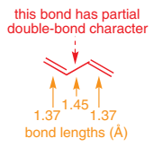{ width = "10" }
</figure>

??? info "应用：为什么很多色素都含共轭结构"
    
    相比 $\pi$ 轨道与 $\pi^*$ 轨道，$\psi_2$ 和 $\psi_3$ 轨道能级差更小，更长的波长（如可见光）也能实现激发，因此，含共轭结构的物质更容易吸收部分可见光，反射其它可见光，从而呈现颜色
    <figure markdown>
      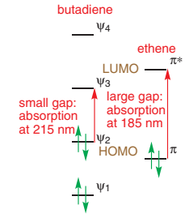{ width = "10" }
    </figure>

## TOPIC2:一些经典的共轭结构

### 1 烯丙基（allyl）离子

#### 烯丙基负离子（anion）

* 烯丙基负离子的生成：烯丙基中 $sp^3$ C上的一个H被拔去，并留下它共享的那个电子

此时这个C会改变为 $\mathrm{sp}^2$ 结构，未杂化的p轨道上含有2个电子（用负电荷符号表示），并且与旁边的$\pi$键平行，因此产生共轭

<figure markdown>
  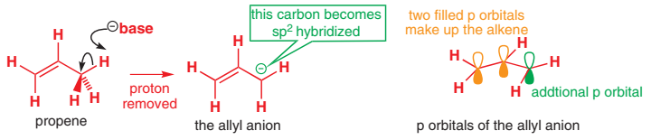{ width = "10" }
</figure>

我们同样将这3个p轨道重新组合，得到3个分子轨道，依次含有0、1、2个node，然后填充4个电子，因此前两个轨道填满了电子

<figure markdown>
  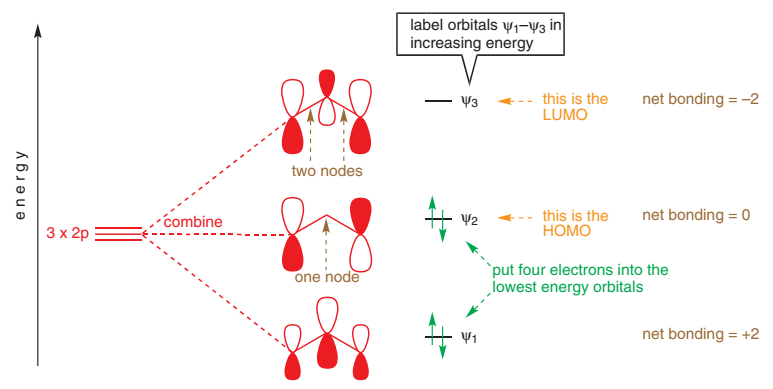{ width = "10" }
</figure>

由于$\psi_2$中C2上无轨道，因此叠加后C2的轨道成分较小，所以负电荷虽然因为离域不局限于C3，但更多地是分布在C1和C3

用共振式表达：

<figure markdown>
  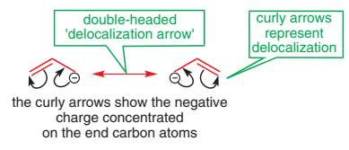{ width = "10" }
</figure>

同样要避免共振式潜在的误导：注意负电荷并没有在两个C上反复横跳！

??? info "通过核磁共振碳谱体现共轭效应"

    边上的两个C在核磁碳谱中都是51ppm下共振的，即这两个C是相同环境的

#### 烯丙基正离子（cation）

* 烯丙基正离子的生成：烯丙基中 $sp^3$ C上的一个H被拔去，并带走2个电子

此时这个C会改变为 $sp^2$ 结构，未杂化的p轨道为空轨道（用正电荷符号表示），并且与旁边的$\pi$键平行，因此产生共轭

<figure markdown>
  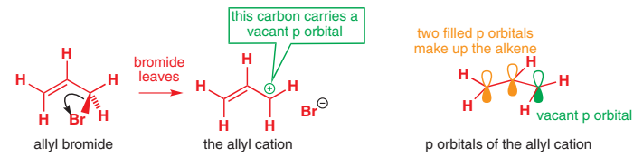{ width = "10" }
</figure>

我们同样将这3个p轨道重新组合，得到3个分子轨道，依次含有0、1、2个node，然后填充2个电子，因此只有1个轨道填满了电子

<figure markdown>
  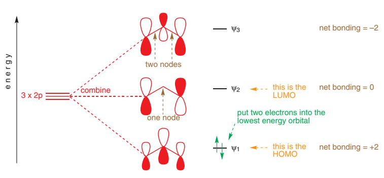{ width = "10" }
</figure>

由于$\psi_1$中C2上轨道系数大于两边的，因此电子倾向于分布在中间的C上，正电荷更倾向于分布在两侧

用共振式表达：

<figure markdown>
  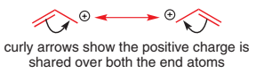{ width = "10" }
</figure>

同样要避免共振式潜在的误导：注意正电荷并没有在两个C上反复横跳！

### 2 羧基负离子

羧基被拔去了H成为负离子时，也出现了共轭效应 — 羟基的O变成了sp2杂化，留下含有孤对电子的p轨道，与羰基的2个p轨道一起形成了共轭

<figure markdown>
  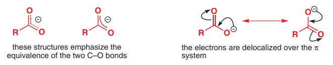{ width = "10" }
</figure>

### 3 硝基

硝基的结构中

<figure markdown>
  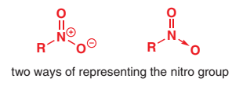{ width = "10" }
</figure>

### 4 酰胺

<figure markdown>
  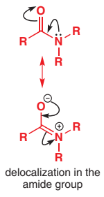{ width = "10" }
</figure>

## TOPIC3：芳香性（Aromaticity）

* 上面证实了不管成环还是不成环，单双键交替的共轭结构都能成立并体现相应性质

* 但苯环依然有它的特殊性，例如，一般的双键与卤素单质无需催化剂发生加成，但苯与卤素单质却发生取代，还需要催化剂。可以认为是苯环有保持它这个特殊结构的共轭倾向。

可能因为成环，所以苯具有这样的性质。但看一个八元的单双键交替结构，它就没有共轭，我们发现它的八个C原子不在同一平面上，p轨道根本没法共轭

<figure markdown>
  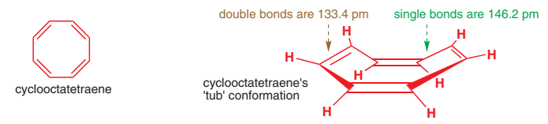{ width = "10" }
</figure>

然后，我们又发现，如果用特殊手段拔掉2个H-，让八元环带两个正离子，此时，这个八元环不仅呈现平面结构，并且所有CC键键长相等

<figure markdown>
  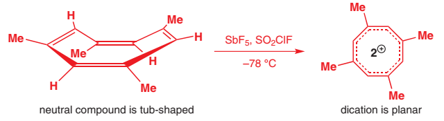{ width = "10" }
</figure>

如果让八元环带2个负离子，也得到相同的结果

实际上，八元环从稳定结构到平面结构会产生张力使其回到稳定结构，这个张力应该与电子个数无关。
那么，必然存在一种性质，这个性质提供了能对抗张力的作用使分子呈现平面结构

因此，我们推测，环上 $\pi$ 电子的数量将是影响这一性质的关键，我们将这一性质称为**芳香性**

### 用分子轨道理论解释芳香性

我们从苯环出发，画出6条分子轨道，经过计算，它们的能级如下：

<figure markdown>
  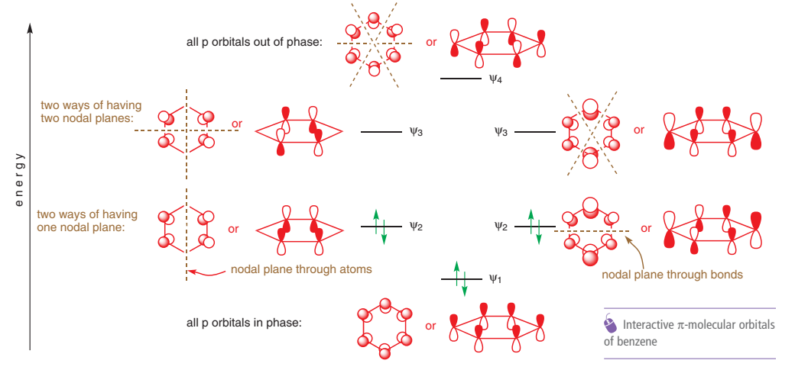{ width = "10" }
</figure>

因此，苯环上的6个电子进入前3个轨道

参照苯环，我们可以画出任意元C环上的共轭分子轨道。其中红线经过的轨道为非键轨道，红线以上的是反键轨道，红线以下的是成键轨道

<figure markdown>
  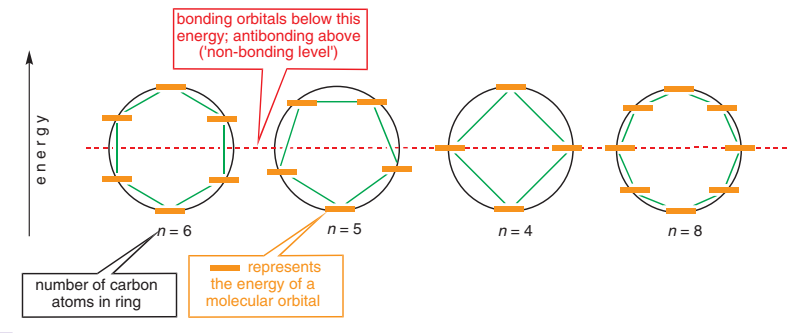{ width = "10" }
</figure>

* 苯环的6个电子正好填满了成键轨道，不多不少（称为"closed shell"）

* 八元环的8个电子填满了成键轨道，但没有填满非键轨道

* 八元环阳离子的6个电子正好填满了成键轨道，不多不少

* 八元环阴离子的10个电子正好填满了成键轨道和非键轨道，不多不少

<figure markdown>
  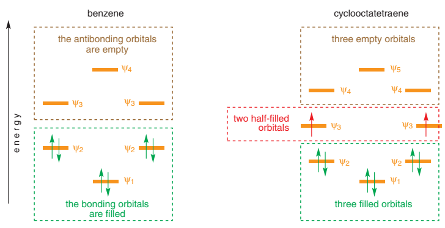{ width = "10" }
</figure>

结合现象，我们发现了一个很重要的规律：

!!! note "休克尔规则"
    
    平面结构、完全共轭的环状系统中，若 $\pi$ 电子数量为 (4n+2) ，则它会形成closed shell，具有芳香性

需要注意，Huckel规则并不只要求电子数4n+2，如下图中，分子 ① 虽然是10个电子，但十元环的环张力太大，无法形成平面结构，因此不具有芳香性。而②中C-C键键角为120°，呈现平面结构，因此具有芳香性。③ 的20元环虽然几近平面（意思是平面产生的张力很小），但它的电子数是20个，因此不具有芳香性。

<figure markdown>
  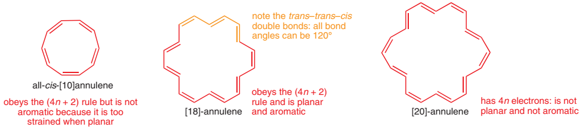{ width = "10" }
</figure>

萘环根据规则，同样具有芳香性，但比苯环来得弱，上面的双键键长也不相等。

<figure markdown>
  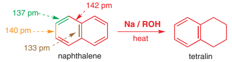{ width = "10" }
</figure>

### 杂环当然可以有芳香性

如果环中的部分C被N、O等其它原子替代，就会成为杂环（Heterocyclic），实际上，大部分的芳香环都是杂环，例如哌啶、吡咯等。

    

